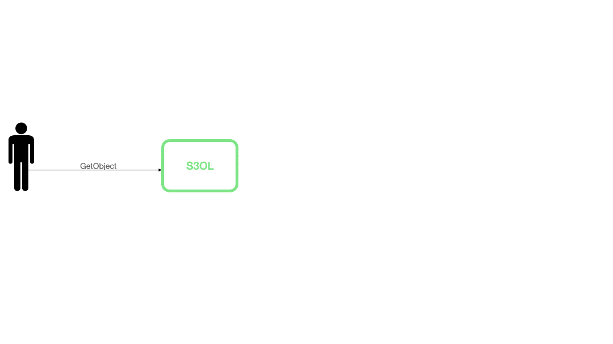

 # PII Redaction S3 Object Lambda function
	   
This serverless app helps you redact PII (Personally Identifiable Information) from valid text files present in S3. 
This app deploys a Lambda function which can be attached to S3 object lambda access point.   
The lambda function internally uses AWS Comprehend to detect PII entities from the text 

## App Architecture


Lambda function is optimized to leverage Comprehend's ContainsPiiEntities and DetectPIIEntities API efficiently to save time and cost for large documents  
ContainsPiiEntities API is a high-throughput API which acts as a filter so only those documents that contain PII are sent to the DetectPIIEntities API for the compute heavy PII redaction task

1. Lambda function is invoked with a request containing information about the S3 object to get and transform.
2. The request contains a S3 presigned url to fetch the requested object. 
3. The data is split into chunks that are accepted by Comprehend’s ContainsPiiEntities API and call the API with each chunk.
4. For each chunk which contains PII data, the chunks are split further into smaller chunks with max size supported by Comprehend’s DetectPiiEntities API.
5. For each of these smaller PII chunks, Comprehend’s DetectPIIEntities API is invoked to detect the text spans containing interested PII entities.
6. The responses are aggregated from all chunks.
7. Lambda function callsback S3 with the response i.e the redacted document. 
8. If any failure happens while processing, Lambda function returns an appropriate error response to S3 which will be returned to the original caller.
9. Lambda function returns with 0 exit code .i.e. with out any error if no error occurred else would fail.

## Installation Instructions

1. [Create an AWS account](https://portal.aws.amazon.com/gp/aws/developer/registration/index.html) if you do not already have one and login
1. Go to the app's page on the [Serverless Application Repository](https://console.aws.amazon.com/lambda/home#/create/app?applicationId=arn:aws:serverlessrepo:us-east-1:839782855223:applications/ComprehendPiiRedactionS3ObjectLambda) 
1. Provide the required app parameters (see parameter details below) and click "Deploy"

## Parameters
Following are the parameters that you can tune to get desired behavior
#### Environment variables
Following environment variables for Lambda function can be set to get desired behaviour.  
1. `LOG_LEVEL`  - Log level for Lambda function function logging, e.g., ERROR, INFO, DEBUG, etc. Default: `INFO`.
1. `UNSUPPORTED_FILE_HANDLING` Handling logic for Unsupported files. Valid values are `PASS` and `FAIL` (Default: `FAIL`). If set to `FAIL` it will throw UnsupportedFileException when the requested object is of unsupported type.
1. `IS_PARTIAL_OBJECT_SUPPORTED` Whether to support partial objects or not. Accessing partial object through http headers such byte-range can corrupt the object and/or affect PII detection accuracy. Valid values are `TRUE` and `FALSE`. Default: `FALSE`.
1. `DOCUMENT_MAX_SIZE_CONTAINS_PII_ENTITIES` Maximum document size (in bytes) to be used for making calls to Comprehend's ContainsPiiDocument API for classifying PII entity types present in the doc Default: 50000. 
1. `DOCUMENT_MAX_SIZE_DETECT_PII_ENTITIES`: Maximum document size (in bytes) to be used for making calls to Comprehend's DetectPiiEntities API. Default: 5120 i.e. 5KB. 
1. `PII_ENTITY_TYPES` : List of comma separated PII entity types to be considered for redaction. Refer [Comprehend's documentation page](https://docs.aws.amazon.com/comprehend/latest/dg/how-pii.html#how-pii-types) for list of supported PII entity types. Default: `ALL` which signifies all entity types that comprehend supports.
1. `MASK_CHARACTER` : A character that replaces each character in the redacted PII entity. Default: *.
1. `MASK_MODE` : Specifies whether the PII entity is redacted with the mask character or the entity type. Valid values: `MASK` and `REPLACE_WITH_PII_ENTITY_TYPE`. Default: `MASK`.
1. `SUBSEGMENT_OVERLAPPING_TOKENS` : Number of tokens/words to overlap among segments of a document in case chunking is needed because of maximum document size limit. Default: 20.
1. `DOCUMENT_MAX_SIZE` : Default maximum document size (in bytes) that this function can process otherwise will throw exception for too large document size.
1. `CONFIDENCE_THRESHOLD` : The minimum prediction confidence score above which PII classification and detection would be considered as final answer. Valid range (0.5 to 1.0). Default: 0.5 .
1. `MAX_CHARS_OVERLAP` : Maximum characters to overlap among segments of a document in case chunking is needed because of maximum document size limit. Default: 2.
1. `DEFAULT_LANGUAGE_CODE` : Default language of the text to be processed. This code will be used for interacting with Comprehend . Default: en.
1. `DETECT_PII_ENTITIES_THREAD_COUNT` : Number of threads to use for calling Comprehend's DetectPiiEntities API. This controls the number of simultaneous calls that will be made from this Lambda function. Default: 8.
1. `CONTAINS_PII_ENTITIES_THREAD_COUNT` : Number of threads to use for calling Comprehend's ContainsPiiEntities API. This controls the number of simultaneous calls the will be made from this Lambda function. Default: 20.
1. `PUBLISH_CLOUD_WATCH_METRICS` : This determines whether or not to publish metrics to Cloudwatch. Default: true.

#### Runtime variables
You can add following arguments in S3 object lambda access point configuration payload to override the default value configured used by the Lambda function . These values would take precedence over environment variables. Provide these variables as a json string like the following example.
```
    ...
    "payload": "{\"pii_entity_types\" : [\"CREDIT_DEBIT_NUMBER\"],\"mask_mode\":\"MASK\", \"mask_character\" : \"*\",\"confidence_threshold\":0.6,\"language_code\":\"en\"}"
    ...
```
Use these parameters to get desired behaviors from different access point configuration attached to the same lambda function.     
1. `pii_entity_types` : List of PII entity types to be considered for redaction. e.g.  `["SSN","CREDIT_DEBIT_NUMBER"]`
1. `mask_mode` : Specifies whether the PII entity is redacted with the mask character or the entity type. Valid values: `MASK` and `REPLACE_WITH_PII_ENTITY_TYPE`.  
1. `mask_character` : A character that replaces each character in the redacted PII entity.
1. `confidence_threshold` :The minimum prediction confidence score above which PII classification and detection would be considered as final answer.
1. `language_code`: Language of the text. This will be used to interact with Comprehend.

## App Outputs

#### Successful response
In case the text file contains PII, it would be redacted and returned in response to GetObject API output  
#### Error responses
Lambda function would forward the standard [S3 error responses](https://docs.aws.amazon.com/AmazonS3/latest/API/ErrorResponses.html) it will receive while downloading the file from S3
  
Further following error responses will be thrown by Lambda function:

|Status Code|Error Code|Error Message|Description|
|---|---|---|---|
| BAD_REQUEST_400 | InvalidRequest | Lambda function has been incorrectly setup | An incorrect configuration which restricts lambda function to even start handling the incoming events|
| BAD_REQUEST_400 | UnexpectedContent |  Unsupported file encountered for determining PII | This error would be thrown in case caller tries to get an invalid utf8 file (e.g image) and UNSUPPORTED_FILE_HANDLING variable is set to FAIL|  
| BAD_REQUEST_400 | EntityTooLarge | Size of the requested object exceeds maximum file size supported  | This error would be thrown in case caller tries to get an object which is beyond the max file size supported|
| BAD_REQUEST_400 | RequestTimeout | Failed to complete document processing within time limit  | This error would be thrown in case lambda is not able to complete the processing of the document within the time limit. This could be because your file size is too big or you are getting throttled by either S3 or Comprehend.|      
| INTERNAL_SERVER_ERROR_500 | InternalError | An internal error occurred while processing the file | Any other error occurred while processing the object |   

## Metrics
Metrics are published after each invocation of the lambda function and are a best effort attempt (Failures in CloudWatch metric publishing are ignored)

All metrics will be under the Namespace: ComprehendS3ObjectLambda

### Metrics for processed documents
|MetricName|Description|Unit|Dimensions|
|---|---|---|---|
|PiiDocumentsProcessed|Emitted after processing a document that contains pii|Count|S3ObjectLambdaAccessPoint, Language|
|DocumentsProcessed|Emitted after processing any document|Count|S3ObjectLambdaAccessPoint, Language|
|PiiDocumentTypesProcessed|Emitted after processing a document that contains PII for each type of PII of interest|Count|S3ObjectLambdaAccessPoint, Language, PiiEntityType|

### Metrics for Comprehend operations
|MetricName|Description|Unit|Dimensions|
|---|---|---|---|
|Latency|The latency of Comprehend DetectPiiEntities API|Milliseconds|Comprehend, DetectPiiEntities|
|Latency|The latency of Comprehend ContainsPiiEntities API|Milliseconds|Comprehend, ContainsPiiEntities|
|ErrorCount|The error count of Comprehend DetectPiiEntities API|Count|Comprehend, DetectPiiEntities|
|ErrorCount|The error count of Comprehend ContainsPiiEntities API|Count|Comprehend, ContainsPiiEntities|

### Metrics for S3 operations
|MetricName|Description|Unit|Dimensions|
|---|---|---|---|
|Latency|The latency of S3 WriteGetObjectResponse API|Milliseconds|S3, WriteGetObjectResponse|
|Latency|The latency of downloading a file from a presigned S3 url|Milliseconds|S3, DownloadPresignedUrl|
|ErrorCount|The fault count of S3 WriteGetObjectResponse API|Count|S3, WriteGetObjectResponse|
|ErrorCount|The fault count of downloading a file from a presigned S3 url|Count|S3, DownloadPresignedUrl|

## License Summary

This code is made available under the MIT-0 license. See the LICENSE file.